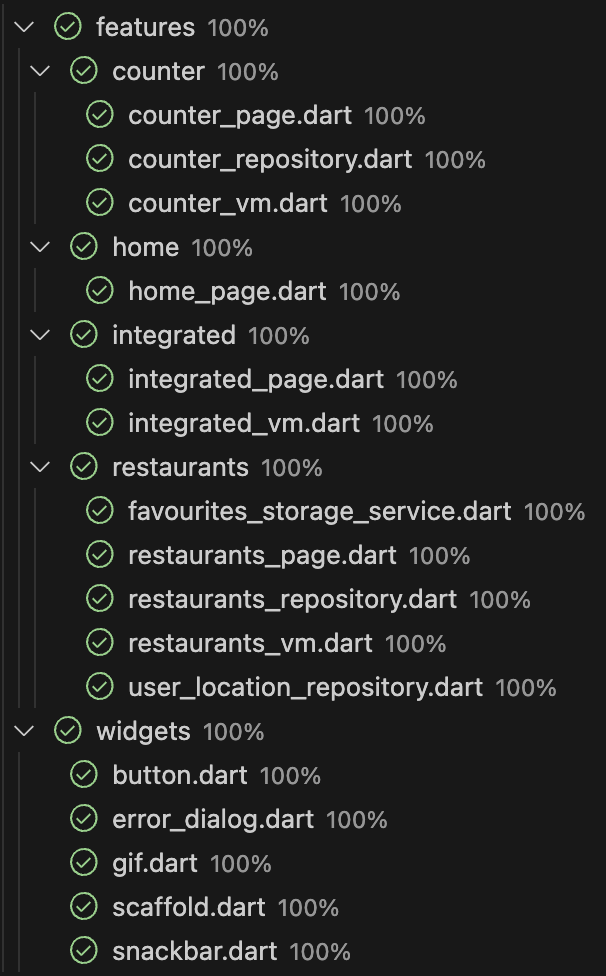

[← Back](../README.md)

# MVVM Framework - Examples

This folder contains three examples demonstrating the usage of the MVVM Framework in Flutter applications. <br />
Each example showcases a specific feature and includes both implementation and testing details.

## Examples

1. [Basic Feature](./README_BASIC.md)<br />
A minimal counter application designed to introduce the fundamentals of the MVVM architecture. This example avoids external packages, focusing solely on the core principles of MVVM to provide a clear and concise learning experience.

2. [Counter Feature](./README_COUNTER.md)<br />
A simple counter application demonstrating the basics of MVVM architecture.

3. [Restaurants Feature](./README_RESTAURANTS.md)<br />
A more complex example showcasing how the MVVM framework can handle advanced scenarios, such as managing dynamic user location updates, handling loading and error states manually, and implementing custom UI behaviors like displaying user movement direction and pausing location updates. This example highlights the flexibility and scalability of the MVVM architecture for real-world applications.

4. [Integrated Feature](./README_INTEGRATED.md)<br />
An example showcasing how to use a nesting of MVVM components and how to interact with them. This feature demonstrates integrating multiple MVVM-based components, such as counter and restaurants features, into a single cohesive application while maintaining clear separation of concerns and interaction between the components.

For more details, refer to the individual README files linked above.

## Error Handling

The `ConfigMVVM` is initialized to manage errors globally across the application. It demonstrates handling two types of errors:

1. **Generic Errors**: Displayed using a `showDialog` to provide detailed feedback to the user.
2. **Network Errors**: Displayed using a `SnackBar` for non-intrusive notifications.

This configuration ensures consistent and user-friendly error handling throughout the application.

```dart
Future<void> main() async {
  WidgetsFlutterBinding.ensureInitialized();
  ConfigMVVM.initialize(
      onGenericError: (errorContext) => GenericErrorManager(errorContext).manageError());
```

## Running the Examples

To run the examples, navigate to the root of the project and execute:

```bash
./scripts/generate_code.sh
cd example
flutter run lib/main.dart
```

## Test Coverage
Achieving 100% test coverage is made possible by the MVVM framework, which simplifies the process of writing comprehensive and effective tests.



## Packages Used

The example app uses the following packages:

- [freezed](https://pub.dev/packages/freezed): A code generator for immutable classes and unions/abstract classes in Dart.
- [get_it](https://pub.dev/packages/get_it): A simple service locator for dependency injection in Dart and Flutter.
- [go_router](https://pub.dev/packages/go_router): A declarative routing package for Flutter, supporting deep linking and navigation.
- [injectable](https://pub.dev/packages/injectable): A code generator for dependency injection using annotations.
- [shared_preferences](https://pub.dev/packages/shared_preferences): A plugin for reading and writing simple key-value pairs to persistent storage.
- [mockito](https://pub.dev/packages/mockito): A package for creating mock objects in Dart for testing purposes.
- [flutter_image_test_utils](https://pub.dev/packages/flutter_image_test_utils): A utility package for testing image-related functionality in Flutter.
