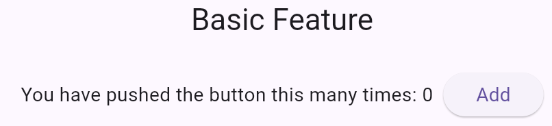

[← Back](./README.md)

# Basic Feature

The Basic feature demonstrates a minimal counter application using the MVVM architecture.

It allows users to increment a counter and display the current counter value in the UI. This example focuses on the core principles of MVVM without relying on external packages, making it ideal for beginners.



---

## Code

### Model

The `BasicModel` defines the state of the counter, including the view status and the current value.

```dart
class BasicModel implements Model {
  const BasicModel(this.viewStatus, this.value);

  @override
  final ViewStatus viewStatus;
  final int value;

  BasicModel copyWith({ViewStatus? viewStatus, int? value}) =>
      BasicModel(viewStatus ?? this.viewStatus, value ?? this.value);

  @override
  BasicModel copyWithViewStatus(ViewStatus viewStatus) => copyWith(viewStatus: viewStatus);
}
```

- **`viewStatus`**: Tracks the current state of the view: initial, loading, success, failure.
- **`value`**: Holds the current counter value.
---

### ViewModel

The `BasicVM` contains the business logic for the Basic feature. It manages the state of the counter and provides methods to update it.

#### Increment logic

```dart
Future<void> increment() async => emit(state.copyWith(value: state.value + 1));
```

It increments the counter value and updates the state.

---

### View

The `BasicPageView` is responsible for rendering the UI and interacting with the `BasicVM`.

```dart
class BasicPageView extends ViewWidget<BasicVM> {
  const BasicPageView({super.key});

  @override
  Widget build(BuildContext context) {
    final count = select(context, (vm) => vm.state.value);
    return AppScaffold(
      title: 'Basic Feature',
      page: Align(
        alignment: Alignment.topCenter,
        child: Row(
          mainAxisSize: MainAxisSize.min,
          children: [
            Text('You have pushed the button this many times: $count  '),
            AppButton(label: 'Add', onPressed: vm(context).increment),
          ],
        ),
      ),
    );
  }
}
```

It displays the current counter value and provides a button to increment the counter.
