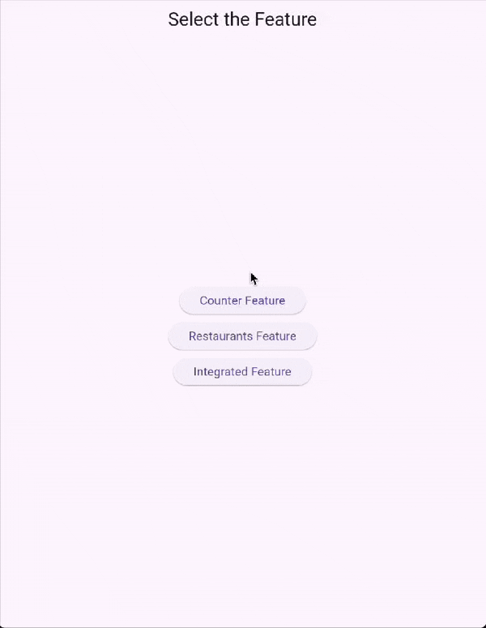

[← Back](./README.md)

# Counter Feature

The Counter feature demonstrates a simple counter application using the MVVM architecture.

It allows users to increment a counter, simulate an increment with a generic exception that is gracefully handled by the MVVM framework, and display the current counter value in the UI.



---

## Code

### Model

The `CounterModel` defines the state of the counter, including the view status and the current value.

```dart
@freezed
abstract class CounterModel with _$CounterModel implements Model {
  const factory CounterModel({
    @Default(viewStatusLoading) ViewStatus viewStatus,
    @Default(0) int value,
```

- **`viewStatus`**: Tracks the current state of the view: initial, loading, success, failure.
- **`value`**: Holds the current counter value.

The `CounterModel` is immutable and uses the `freezed` package to generate boilerplate code for equality, copy, and more.

---

### ViewModel

The `CounterVM` contains the business logic for the counter feature. It interacts with the `CounterRepository` to fetch and update the counter value.

#### Initialization

```dart
@override
Future<void> onInit() async {
  final value = await _counterRepository.getValue();
  emit(state.copyWith(value: value, viewStatus: viewStatusSuccess));
}
```

- Fetches the initial counter value from the repository.
- Updates the state with the fetched value and sets the view status to success.

#### Increment logic

```dart
Future<void> increment() async {
  emit(state.copyWith(viewStatus: viewStatusLoading));
  final newValue = state.value + 1;
  await _counterRepository.updateValue(newValue);
  emit(state.copyWith(value: newValue, viewStatus: viewStatusSuccess));
}
```

- Sets the view status to loading.
- Increments the counter value and updates it in the repository.
- Updates the state with the new value and sets the view status to success.

#### Handling exceptions

The `incrementWithException` method demonstrates how to handle exceptions gracefully in the `CounterVM`.

```dart
Future<void> incrementWithException() => safeExecute(() => increment(true));
```

- **`safeExecute`**: A utility method provided by the MVVM framework to wrap asynchronous operations and handle exceptions in a standardized way. It ensures that any errors occurring during the execution of the provided function are caught and processed without crashing the application.
- **`increment(true)`**: Calls the `increment` method with a parameter to simulate an exception scenario.

This method is particularly useful for testing error handling and ensuring the application remains stable under unexpected conditions.

### View

The `CounterPageView` provides the UI for the counter feature. It displays the current counter value and includes a button to increment the counter.

#### Increment button

```dart
floatingActionButton: FloatingActionButton(
  onPressed: vm(context).increment,
  tooltip: 'Increment',
  child: const Icon(Icons.add),
),
```

It provides a floating action button to trigger the `increment` method in the `ViewModel`.

#### Counter value view

```dart
Widget build(BuildContext context) {
  final count = select(context, (vm) => vm.state.value);
  return Text(
    count.toString(),
    style: Theme.of(context).textTheme.headlineMedium,
  );
```

It displays the current counter value using `select(context, (vm) => vm.state.value)`.


---

## Testing

The Counter feature includes unit and widget tests to ensure its functionality.

### Unit Tests

Unit tests verify the business logic in the `CounterVM` class.

```dart
test('should increment value', () async {
  await uut.onInit();
  await uut.increment();
  expect(uut.state.value, initValue + 1);
  verify(counterRepository.updateValue(initValue + 1)).called(1);
});
```

It ensures the `increment` method correctly updates the counter value and call the `counterRepository.updateValue`

### Widget Tests

Widget tests ensure the UI behaves as expected.

```dart
testWidgets('should calls increment when floating action button is pressed', (tester) async {
  await tester.pumpWidget(uut);
  await tester.tap(find.byType(FloatingActionButton));
  await tester.pumpAndSettle();
  verify(vm.increment()).called(1);
});
```

It verifies that `increment` method is called when the button is pressed.